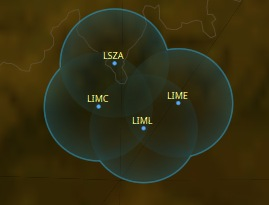
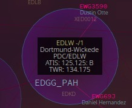
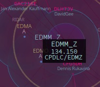
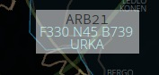
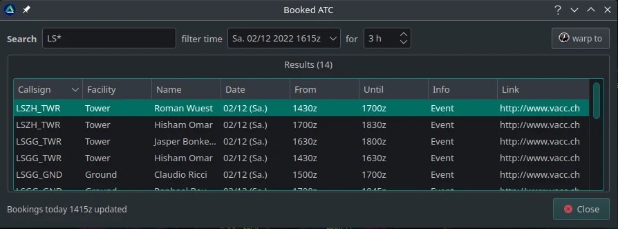
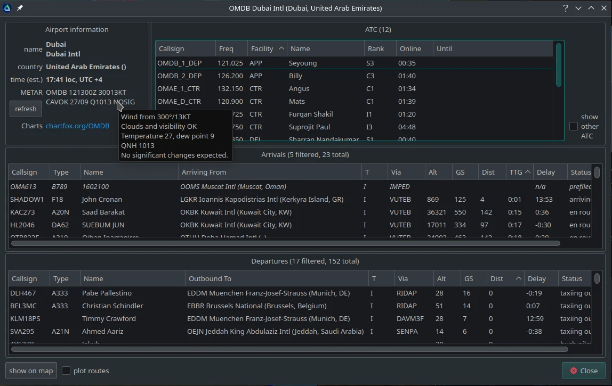
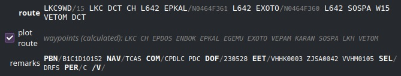

# QuteScoop 

QuteScoop is a status indicator for the online flight simulation community VATSIM, compatible with Windows, Linux and MacOS.

[More screenshots](https://github.com/qutescoop/qutescoop/tree/master/docs/images)

Its unique "Time Warp" feature lets you see booked controllers and the traffic
situation in the past or future on the map.

## Resources

[Downloads/Releases](https://github.com/qutescoop/qutescoop/releases)

[Installation](https://github.com/qutescoop/qutescoop/wiki/Installation)

[Issues](https://github.com/qutescoop/qutescoop/issues)

[Wiki](https://github.com/qutescoop/qutescoop/wiki)
